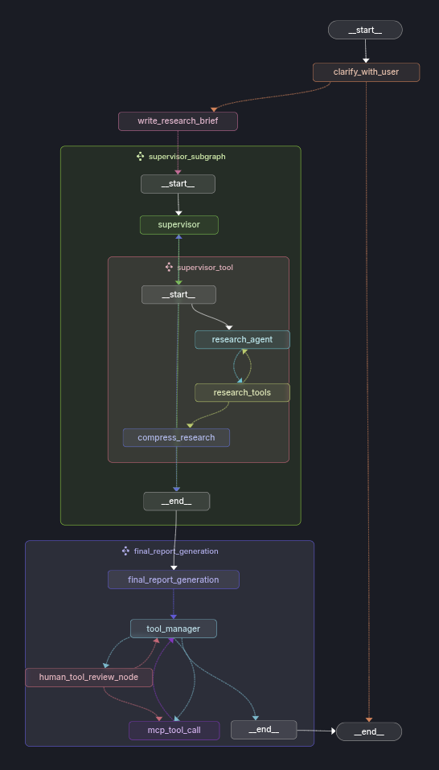

# project-planning-genie

An intelligent AI-powered project planning agent that transforms project descriptions into comprehensive, actionable implementation plans. Built with LangGraph and multi-agent architecture to deliver structured markdown reports perfect for GitHub issues and project management.

## 🚀 Overview

This project planning agent helps developers and teams break down complex project ideas into manageable, step-by-step implementation plans. By leveraging advanced AI agents and workflow orchestration, it generates detailed project roadmap that can be directly used as GitHub issues, project boards, or documentation.


**Key Features:**

- **Intelligent Project Analysis**: Automatically decomposes project descriptions into actionable tasks
- **Multi-Agent Architecture**: Specialized agents for clarification, planning (supervisor and researcher), and report generation
- **Markdown Report Generation**: Outputs formatted plans ready for GitHub issues
- **Extensible Design**: Built with modern software engineering patterns for easy enhancement

## 🎯 What It Does

1. **Project Intake**: Accepts natural language project descriptions
2. **Requirement Clarification**: Asks intelligent questions to resolve ambiguities
3. **Task Decomposition**: Breaks down projects into logical phases and tasks
4. **Plan Generation**: Creates structured markdown reports with checkboxes and priorities
5. **Validation**: Reviews and refines plans for completeness and feasibility

## 🏗️ Architecture



### Core Components

- **LangGraph StateGraph**: Orchestrates the multi-agent workflow
- **Clarification Agent**: Handles requirement gathering and question generation
- **Supervisor Agent**: Reviews conversation and orchestrates research Agents
- **Research Agent**: Conducts in-depth research and analysis to support planning
- **Report Generation Agent**: Formats the final output into markdown

## 🛠️ Technology Stack

- **Framework**: LangGraph for agent orchestration
- **Language**: Python 3.8+
- **AI Models**: OpenAI GPT, Perplexity, and other LLM providers
- **Testing**: pytest for unit and integration tests

## 🎨 Project Structure

## 🚦 Getting Started

### Prerequisites

- Python 3.8 or higher
- API keys for chosen LLM providers
- Git for version control

### Quick Start

1. **Clone the repository:**

   ```bash
   https://github.com/vivekpatel99/project-planning-genie.git
   cd project-planning-genie
   ```

2. **Create and Activate Virtual Environment (using `uv`)/Setup Project Environment:**

   *First, ensure you have `uv` installed. If not, follow the instructions here.*

   ```bash
   # uv will create a virtual environment named .venv and install dependencies
   uv sync
   ```

3. **Set up Environment Variables:**

   - **`.env` file (Recommended for Local Development)**

     - Create a `.env` file in the project root.
     - Add your credentials and configurations:

     ```dotenv
        # .env
        TAVILY_API_KEY=
        LANGCHAIN_API_KEY=
        OPENAI_API_KEY=

        LANGSMITH_PROJECT=
        LANGCHAIN_TRACING_V2=true
     ```

     - add following line to your vs code settings.json to automatically load the `.env` file:

     ```json
     "python.envFile": "${workspaceFolder}/.env"
     ```

## 🔮 Future Enhancements

- **GitHub Integration**: Automatically create issues and pull requests from generated plans
- **User Feedback Loop**: Incorporate user feedback to improve task generation
- **Performance Analytics**: Track token usage, response times, and accuracy metrics

## 📚 Reference

1. [open_deep_research](https://github.com/langchain-ai/open_deep_research/tree/main)
2. [Open Deep Research-Youtube](https://www.youtube.com/watch?v=agGiWUpxkhg)
3. [LangGraph](https://github.com/langchain-ai/langgraph)
4. https://github.com/kenneth-liao/human-in-the-loop/tree/main
