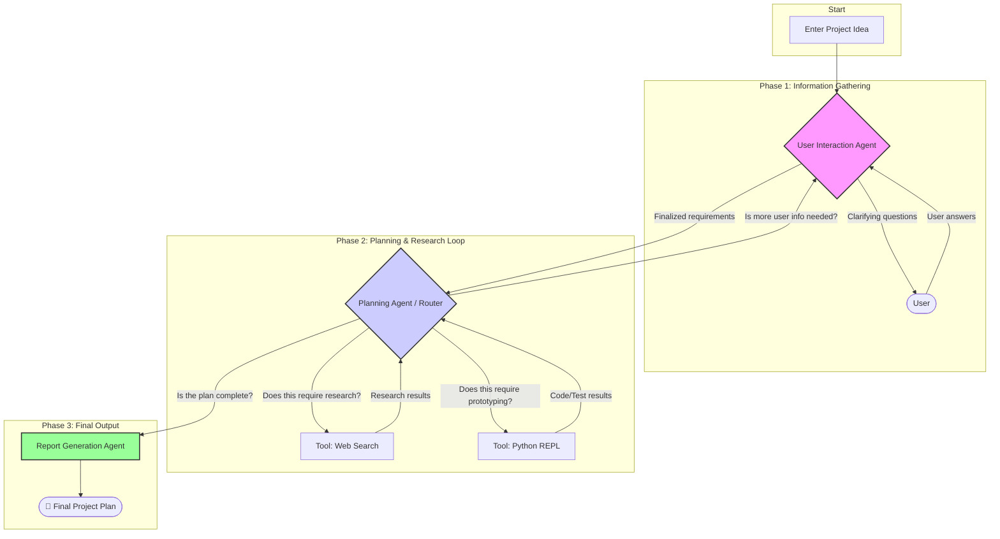

```mermaid
graph TD
    subgraph "Start"
        A[Enter Project Idea]
    end

    subgraph "Phase 1: Information Gathering"
        B{User Interaction Agent}
        C([User])
        A --> B
        B -- "Clarifying questions" --> C
        C -- "User answers" --> B
    end

    subgraph "Phase 2: Planning & Research Loop"
        D{Planning Agent / Router}
        T1[Tool: Web Search]
        T2[Tool: Python REPL]

        B -- "Finalized requirements" --> D
        D -- "Is more user info needed?" --> B
        D -- "Does this require research?" --> T1
        T1 -- "Research results" --> D
        D -- "Does this require prototyping?" --> T2
        T2 -- "Code/Test results" --> D
    end

    subgraph "Phase 3: Final Output"
        E[Report Generation Agent]
        F([📄 Final Project Plan])
        D -- "Is the plan complete?" --> E
        E --> F
    end

    %% Styling
    style B fill:#f9f,stroke:#333,stroke-width:2px
    style D fill:#ccf,stroke:#333,stroke-width:2px
    style E fill:#9f9,stroke:#333,stroke-width:2px
```

