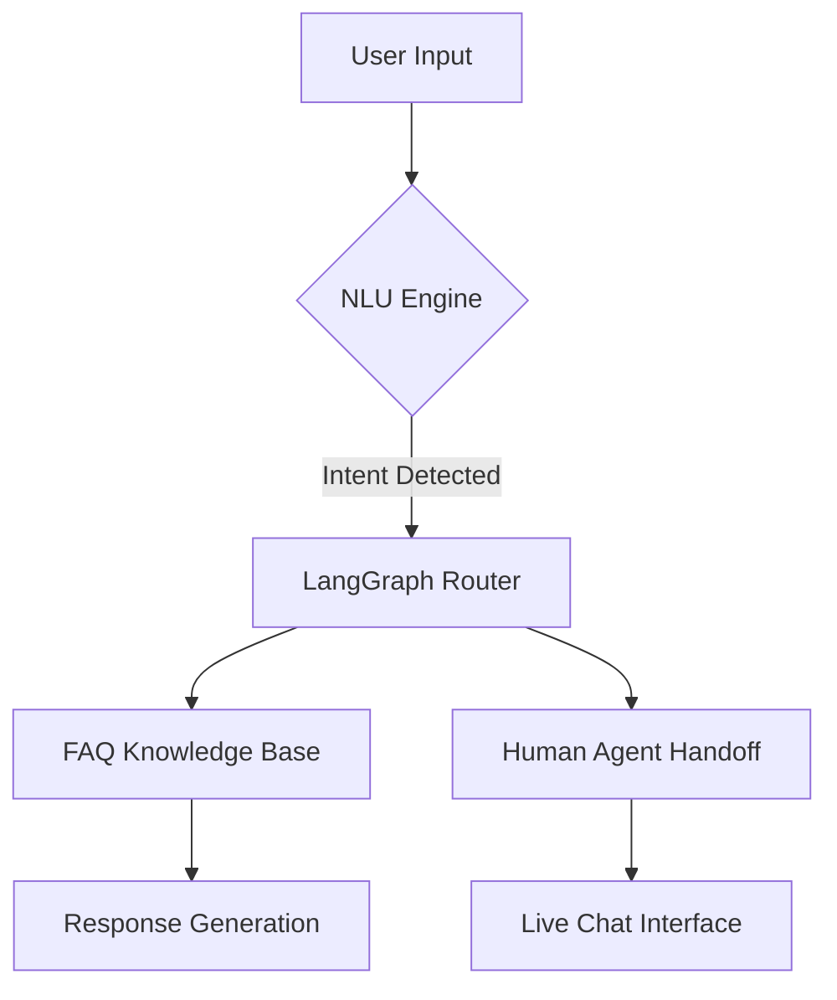

## Software Design Report: LangGraph Chatbot

### 1. Project Scope

- Simple rule-based chatbot
- Core functionality: Answer FAQs, route to human agent
- Tech stack: LangGraph for workflow orchestration

### 2. Architecture

